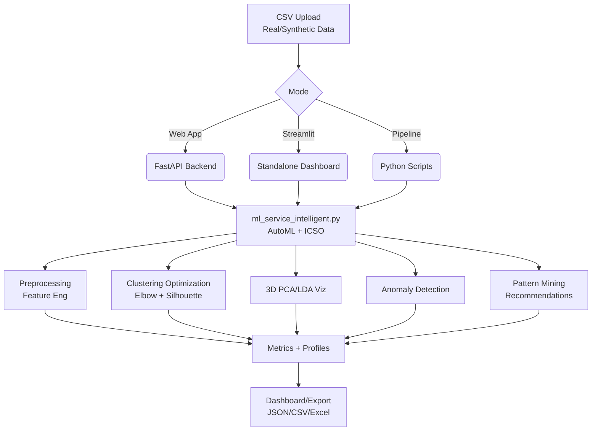

# 🧠 User Behavior Intelligence Platform

[](https://www.python.org/)
[](https://streamlit.io)
[](https://reactjs.org)
[](https://fastapi.tiangolo.com)
[](https://streamlit.io)

**Advanced ML platform for e-commerce user segmentation, clustering optimization (ICSO metric), anomaly detection, pattern mining, and actionable insights.**

Supports **real & synthetic datasets** (15-5000 users). **AutoML** selects best algorithm (KMeans/DBSCAN/Hierarchical). **Novel ICSO metric** maximizes inter-cluster separation. **3D PCA/LDA visualizations**, supervised validation (up to 98% accuracy).

## 🚀 Quick Start (5 minutes)

### Option 1: Full Web App (Recommended)
```bash
# Backend (Terminal 1)
.\run_backend.bat

# Frontend (Terminal 2)  
cd UserBehaviorApp/frontend
npm install
npm start
```
- Open [http://localhost:3000](http://localhost:3000)
- Demo: `demo@example.com` / `demo123`
- Upload CSV → Analyze → View clusters/metrics/recommendations

### Option 2: Streamlit Dashboard (Pure Python)
```bash
pip install -r requirements.txt
.\run_streamlit.bat
```
- Open [http://localhost:8502](http://localhost:8502)
- Interactive: Elbow plots, 3D animations, anomaly bubbles, CSV export

### Option 3: Standalone Pipeline
```bash
.\run_pipeline.bat  # or python main.py
```
Generates reports, plots, CSV/Excel exports.

## 📊 Features

| Feature | Description | Web App | Streamlit |
|---------|-------------|---------|-----------|
| **AutoML Clustering** | KMeans/DBSCAN/Hierarchical + optimal K (elbow/silhouette) | ✅ | ✅ |
| **ICSO Metric** | Novel inter-cluster separation optimization | ✅ | ✅ |
| **Metrics** | Silhouette, DBI, CH, supervised accuracy (98% max) | ✅ | ✅ |
| **3D Viz** | PCA/LDA rotatable, animated | ✅ | ✅ |
| **Anomalies** | Isolation Forest detection | ✅ | ✅ |
| **Pattern Mining** | Apriori rules, recommendations | ✅ | ✅ |
| **Dataset Gen** | Synthetic 5000-user data w/ labels | ✅ | - |

**Sample Results:**
```
Best Algo: KMeans (k=3)
Silhouette: 0.75 ⭐ Excellent
ICSO Score: 11.2
Supervised Accuracy: 98.5%
Anomalies: 9.8%
```

## 🏗️ Architecture



**Key Components:**
- **Backend**: `UserBehaviorApp/backend/` (FastAPI, SQLAlchemy, auth)
- **Frontend**: `UserBehaviorApp/frontend/` (React, Recharts, Tailwind)
- **ML Core**: `backend/ml/` + `ml_service_intelligent.py`
- **Streamlit**: `streamlit_intelligent_dashboard.py`
- **Data**: `data/`, backend samples (`real_user_data_15.csv`, `user_behavior_dataset_5000.csv`)

## 🔧 Detailed Setup

### Prerequisites
- Python 3.8+
- Node.js 18+ (for web app)
- Git

### Clone & Install
```bash
git clone <repo-url>
cd optimization-project

# Python deps
python -m venv venv
venv\Scripts\activate
pip install -r requirements.txt

# Frontend (web app only)
cd UserBehaviorApp/frontend
npm install
```

### Run Modes
See Quick Start badges above.

**No-Auth Backend:**
```bash
.\run_app_no_auth.bat
```

## 📈 Core Processes

1. **Data Prep**: Load CSV → Clean → Features (`total_spent`, `purchase_count`, RFM scores)
2. **AutoML**: Test algorithms → Hybrid score (50% Silhouette + 30% DBI + 20% CH)
3. **Optimization**: Elbow method + Silhouette peak → Optimal K
4. **Clustering**: Best algo → Profiles (spending/engagement)
5. **Viz**: 2D scatter + 3D PCA/LDA (interactive rotate/zoom)
6. **Advanced**: Anomalies (Isolation Forest), rules (Apriori), reco
7. **Validation**: Supervised accuracy if `user_segment` labels present
8. **Export**: Metrics CSV, cluster assignments, insights

**ICSO Metric (Novel)**: `inter_cluster_distance / intra_cluster_variance` - Higher = better separation.

## 🧪 Testing & Samples

- **Quick Test**: Backend folder → `real_user_data_15.csv` (1s, Silhouette ~0.68)
- **Benchmark**: `user_behavior_dataset_5000.csv` (5s, 98% accuracy)
- **Realistic**: `user_behavior_real_patterns_5000.csv` (7s)

Upload via web app or Streamlit.

## 📚 Additional Docs
- [Executive Summary](UserBehaviorApp/EXECUTIVE_SUMMARY.md)
- [Quickstart](QUICKSTART.md)
- [Pipeline Guide](UserBehaviorApp/PIPELINE_INTEGRATION_SUMMARY.md)
- [Streamlit Details](README_STREAMLIT.md)
- [API Docs](http://localhost:8000/docs)

## 🤝 Contributing
1. Fork repo
2. Create feature branch
3. Add tests
4. PR to `main`

## 🚀 Deployment
- **Streamlit Cloud**: Free for dashboard
- **Railway/Heroku**: Full-stack (env vars for DB)
- **Docker**: See `Dockerfile` (TBD)

## 📞 Support
- Issues: GitHub Issues
- Demo Video: [TBD]

**⭐ Star on GitHub if useful!**

---
*Built with ❤️ for user behavior insights.*

