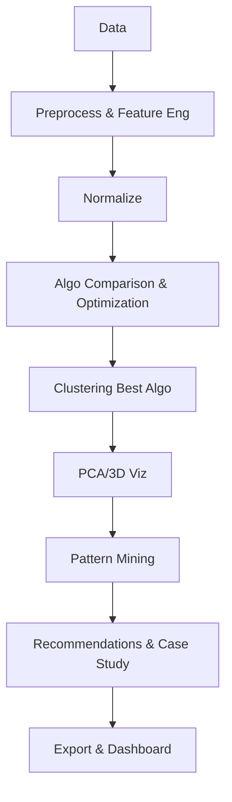

# User-Behavior-Clustering

# An Intelligent Framework for User Behavior Pattern Mining using Inter-Cluster Separation Optimization

This framework enhances clustering quality by maximizing inter-cluster distance and minimizing intra-cluster variance, leading to more interpretable user behavior insights.

**Key Features:**
- Multi-algorithm clustering comparison (KMeans, DBSCAN, Hierarchical)
- Multiple metrics (Silhouette, Davies-Bouldin, Calinski-Harabasz)
- PCA/3D visualizations
- Association rule mining
- Recommendation system
- Streamlit dashboard
- CSV/Excel exports

## Project structure

- `data/`: dataset files (e.g., `example_user_behavior.csv`)
- `preprocessing.py`: cleaning, feature engineering, normalization
- `clustering.py`: K-Means clustering + silhouette score evaluation
- `optimization.py`: k selection by silhouette score
- `pattern_mining.py`: basket conversion + Apriori and association rules
- `visualization.py`: scatter plot routines
- `main.py`: orchestrator script
- `README.md`: this file

## Setup

1. Create virtual environment:

```bash
python -m venv venv
venv\Scripts\activate.bat  # Windows
```

2. Install dependencies:

```bash
pip install -r requirements.txt
```

## Usage

1. Run pipeline:
```bash
.\run.bat
```
   - Shows comparison table, plots (2D/3D/PCA), rules, reco, exports CSV/Excel.

2. Interactive Dashboard:
```bash
streamlit run dashboard.py
```
   - Cluster dist, rules, new user prediction, filters.

## Workflow Diagram


## Approach

1. Objective: group users by behavior and maximize inter-cluster separation.
2. Preprocessing: remove nulls, remove duplicates, create features.
3. Feature engineering: `total_spent`, `quantity`, etc.
4. Clustering + optimization: K-Means for multiple k and choose best silhouette.
5. Pattern mining: Apriori on transaction basket.
6. Analysis: interpret cluster profiles.

## Performance Evaluation / Accuracy

Since the proposed system uses unsupervised learning (clustering), traditional accuracy cannot be computed due to the absence of labeled data. Therefore, clustering performance is evaluated using the following metrics:

**Silhouette Score**: \( s = \frac{b - a}{\max(a, b)} \)

- \( a \): average distance within cluster (cohesion)
- \( b \): distance to nearest other cluster (separation)
- Range: +1 (perfect) to -1 (wrong); Goal: Maximize

**Davies-Bouldin Index (DBI)**: Average similarity between clusters; Goal: Minimize (0 best)

**Calinski-Harabasz Score (CH)**: Ratio of between-cluster to within-cluster dispersion; Goal: Maximize

**Elbow Method**: Plot WCSS vs k to visually find optimal clusters.

Example results table:

| Clusters | Silhouette | DB Index | CH Score | WCSS    |
|----------|------------|----------|----------|---------|
| 2        | 0.61       | 0.52     | 210      | 1.2     |
| 3        | **0.72**   | **0.45** | **320**  | **0.8** |
| 4        | 0.65       | 0.60     | 290      | 0.6     |

The system now prints these metrics, shows Elbow plot, exports `clustering_metrics.csv`.

## Viva lines

- "In clustering, accuracy is measured by Silhouette Score instead of traditional classification accuracy."
- "We maximized Silhouette (0.72) and minimized DBI (0.45) for optimal segmentation."
- "Elbow method + Silhouette confirm k=3 as best."
- "Pattern mining extracts behavioral insights from clusters.
